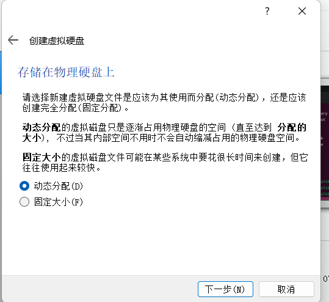
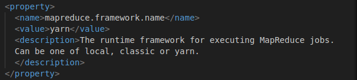
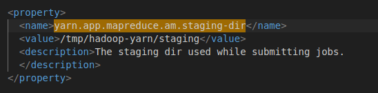
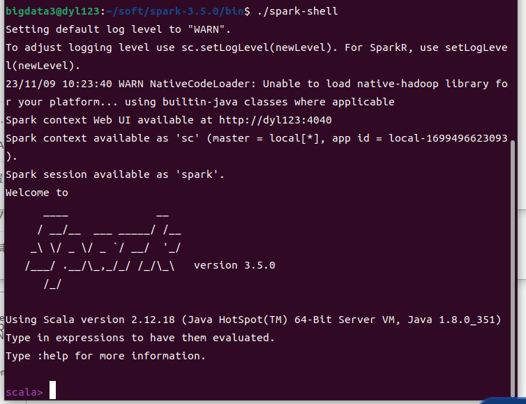
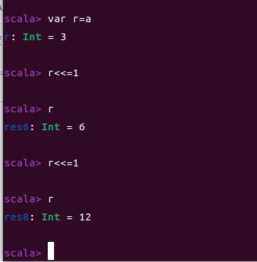

# 大数据第一周
## 1 markdown文件编辑方法
使用vscode编辑markdown文件，首先建立一个目录，在目录上使用右键菜单“open code"
  
在vscode左边的资源管理器中新建一个文件。例如：1.md(扩展名为.md)。
安装三个扩展：
* Markdown All in One;
* Markdown Preview Enhanced;
* Markdown Image.
插图：剪切一个图片到剪切板，在要粘贴图片的地方点击右键，选择（粘贴图片）。
注：图片路径为相对路径。
  
## 2 安装Linux
使用VirtualBox安装ubuntu22.04,Desktop版本。
安装前，硬盘空白空间要大于20G.
### 1）安装前配置
右键以管理员身份运行打开VirtualBox。点击新建：
  
填入相应内容，点击下一步；
  
内存调整为8G，点击下一步；
  
  
  
  

虚拟盘大小建议>60G，点击创建后设置完成。
  
检查设置：
* 系统：cpu核心数，可以选择物理核心数的一半；内存>4G。
  
* 观察网络形式，尽量不修改。
* 加载安装映像：
  
点击选择虚拟盘，指向下载后的iso文件。
  
  
### 2）安装
点击“启动”，界面上选择“Install Ubuntu”，到如下界面需要去掉安装时更新选项：
  
一直继续到选时区，选择上海；然后设置用户名和密码：
  
一直到安装完成之后，点击“重启”：
  
如果启动有问题，可以强制退出，然后退出安装映像，再启动。
### 3）安装后配置和常用软件安装
#### （1）安装增强功能（物理机下没有）
增强功能解决：与host（宿主机）之间的显示匹配、文件共享、剪贴板共享。
从菜单设备->安装增强功能，界面多了一个光盘图标：
  
双击打开光盘：
  
按照惯例分析，应该是运行autorun.sh，在当前界面上点击右键，点击“Open in Terminal”：
  
输入后回车执行：./autorun.sh
安装完成后重启，设置显示和粘贴板。
# 第二周
#### （2）安装软件
安装好linux后需要重新选择镜像源，为了下载速度快。设置方法：点击左下角9个点，找到Software & Updates，将软件源改成国内的镜像。
同步软件源：sudo apt-get update
更新软件：sudo apt-get upgrade
两种方法：使用库安装，下载软件安装。
(1)库安装
安装openssh-server软件：sudo apt-get install openssh-server
安装vim编辑器：sudo apt-get install vim
(2)下载安装
如果库里没有这个软件，或者库里的版本不对，需要下载安装，以安装chrome为例，下载对应的chrome安装包，一般是.deb类型。
安装有多种方式，建议用apt install安装：
在软件所在目录下执行：sudo apt-get install ./google-chrome-stable_current_amd64
#### （3）配置汉字输入法
设置->Region & Language->Manage Installed Language
如果显示需要安装时，允许安装，重启虚拟机。
设置->Keyboard->右侧界面+->选Chinese->选一个自己喜欢的输入法，重启虚拟机。在右上角可以看到汉语输入法的选项。
## 3 linux使用入门
### （1）ls：列表显示当前目录下的目录和文件
不带参数的情况下，显示常规属性的文件和目录：
显示所有文件：带参数-a；
显示详细内容：带参数-l,或者直接用ll
### （2）cd：切换目录
快捷操作：cd：回到家目录；根：/；当前目录：.；上一级目录：..；切换到最新的历史路径：cd -，当前用户家目录：~。
### （3）linux目录结构
linux的图形界面一般只能访问当前用户的家目录内容。
  
mount 挂载，指可切除设备（一般热插拔设备）连接到系统
### （4）pwd：显示当前路径
### （5）创建文件：touch
###  (6) 创建目录：mkdir
可以相对路径（从当前路径开始的），也可以绝对路径（从/开始的）。
### （7）显示文件内容：cat，more，less
cat：显示所有文件内容
more：分页显示，但是只能前进
less：分页显示，可以前进后退
### （8）创建新用户
用图形界面或者命令行（adduser或useradd）都可以。
可以创建新用户的前提是：当前用户拥有sudo权限。
### （9）切换用户
前提是：当前用户拥有sudo权限；或者另外一个用户的权限。
命令：su 用户名
### （10）vim的使用
vim有三种模式：命令、编辑、底行命令（或者说冒号命令）。
进入操作界面是命令模式，按i等进入编辑模式，按Esc键进入命令模式，在命令模式下按冒号键进入底行命令模式。
* 课堂练习:新建一个用户(有sudo权限)，切换到此用户，在此用户家目录下创建并填入一个有100行数据的文件，用cat显示文件内容，再创建一个目录，将此文件移动到此目录下。可用 mv cp
  
  
  

# 第三周
## 1 Ubuntu网络配置
虚拟机注册后，启动前，打开设置，找到网络；
如果是下载的虚拟机，第一次启动前一定要随机化MAC地址。
网络类型改成桥接网卡；
 
启动虚拟机后，设置ip地址：点击右上角网络图标，找到网络设置：
  
  
修改后，查看网络图标，如果正常，打开一个终端，核实IP地址：输入命令：ip a
查看host与虚拟机之间网络连通情况：
从host连虚拟机：cmd下：ping 虚拟机ip
  
从虚拟机连host：在终端下：ping host-ip
  

## 2 软件版本选择
spark，hadoop，scala，java。
软件依赖关系；spark依赖java，spark应用程序在hadoop集群上运行，hadoop依赖java，spark使用scala语言。
* spark依赖；java、hadoop、scala
* hadoop依赖：java
* scala依赖：java
所以版本选择顺序：spark、hadoop、scala、java
### 1）选择spark版本
从https://spark.apache.org查看。从download里查看版本，spark、hadoop、scala的版本关系，从https://hadoop.apache.org里可以看到hadoop和java之间的依赖关系。
  
选择结果：spark选择3.3以上版本，hadoop都是3.3以上版本，scala是2.12，java是java8。
  

### 3.hadoop下载安装
### 1）从官方网站或课程ftp下载。
需要从Ubuntu下下载：打开文件管理器，左侧点击+Other Locations，页面底部出现URL输入框，输入完整的URL后，点击右侧的Connect。
下载后，解压缩：有两种方法：双击（有时候不行），用命令；tar -zxvf hadoop-3.3.6.tar.gz
### 2）基本概念
集群内不可以有安全策略。Ubuntu的安全策略有两个：防火墙、SElinux，但是默认都是关闭的。
集群的模式：
Local：本地模式（单机）
Pseudo-Distributed Mode:伪集群（单机），用java线程模拟
Fully-Distributed Mode：集群（多种）

# 第四周
### 3）需要安装的软件
java8, ssh
#### （1）java
安装到本用户下，即权限是本用户。
下载，解压缩：
tar -zxvf jdk-8u351-linux-x64.tar.gz 
测试软件可用性：运行java

配置路径，路径配置在本用户下：将路径添加的本用户的环境变量PATH里。
编辑 .bashrc，添加如下内容：
```shell
export JAVA_HOME=/home/bigdata3/soft/jdk18
export PATH=$JAVA_HOME/bin:$PATH
```
  
#### （2）ssh
```shell
sudo apt-get install ssh
sudo apt-get install pdsh
```
### 4）下载配置hadoop
#### （1）local模式配置
##### A）配置文件
hadoop软件包下的etc/hadoop/hadoop-env.sh中，配置JAVA_HOME
  

### 5）测试hadoop命令
在hadoop软件包根目录下，执行bin/hadoop：
  

### 6）配置hadoop路径
要配置hadoop根路径和hadoop可执行文件路径到PATH.
```shell
export HADOOP_HOME=/home/bigdata3/soft/hadoop-3.3.6
export PATH=$HADOOP_HOME/bin:$PATH
```
  
新打开一个终端：
  
### 7）local模式运行系统实例
手册上的例子：
  
为了避免在hadoop软件包里写入内容，将路径进行修改：
在家目录下，新建了hadoopExample目录，用于保存程序运行数据。这样相关路径需要使用绝对路径：
  
  
  
## 3 hadoop集群配置
### 1）几个概念：
不作高可用的情况下。
namenode：主节点，master，一台机器
datanode：数据节点，worker，其他机器

# 大数据第五周
## 1 集群配置准备
### （1）用户名要相同 
ssh 域名(用户名)
### （2）写域名解析文件
所有节点名字不同，修改虚拟机名字方法：修改/etc/hostname
写域名解析文件/etc/hosts
  
写法是：
  
验证域名文件：
ping 域名
  
### （3）时间同步
Ubuntu默认是网络时间同步，节点如果可以连接广域网，时间是同步的。全局域网一定要作：选若干个节点作为时间服务器，其他节点与其同步，用ntp工具。
### （4）ssh免密设置
任何一个节点都要做，步骤：生成密钥对，传递公钥到所有节点，包括自己。
如果没有其他的免密，建议先删除.ssh文件夹。
生成密钥对命令：ssh-keygen -t rsa
回车到最后。
  
传递公钥：ssh-copy-id 节点名
  
验证：ssh 节点名，不需要密码，要对所有节点验证，包括自身。
## 2 集群配置
只读文件：core-default.xml,hdfs-default.xml, yarn-default.xml and mapred-default.xml.
如果不在配置文件中写对应的配置，则按照只读文件的配置执行。
需要配置的文件：etc/hadoop/core-site.xml, etc/hadoop/hdfs-site.xml, etc/hadoop/yarn-site.xml and etc/hadoop/mapred-site.xml.
为了编辑配置文件方便，安装vscode：sudo snap install --classic code
  
  
### 1）hadoop-env.sh
增加两个环境变量HADOOP_PID_DIR， HADOOP_LOG_DIR，需要建立两个文件夹，将这两个环境变量指向文件夹。
  
```shell
export JAVA_HOME=/home/bigdata3/soft/jdk18
export HADOOP_PID_DIR=/home/bigdata3/hadoopData/HADOOP_PID_DIR
export HADOOP_LOG_DIR=/home/bigdata3/hadoopData/HADOOP_LOG_DIR
```
 

# 第六周
### 2）core-site.xml
```xml
<configuration>
<property>
  <name>fs.defaultFS</name>
  <value>hdfs://dyl123:9000/</value>
</property>
<property>
  <name>io.file.buffer.size</name>
  <value>131072 </value>
</property>
<property>
  <name>hadoop.tmp.dir</name>
  <value>/home/bigdata3/hadoopData</value>
  <description>A base for other temporary directories.</description>
</property>
</configuration>
```

### 3）hdfs-site.xml
dfs.namenode.name.dir和dfs.datanode.data.dir的默认设置如下：
```xml
<property>
  <name>dfs.namenode.name.dir</name>
  <value>file://${hadoop.tmp.dir}/dfs/name</value>
  <description>Determines where on the local filesystem the DFS name node
      should store the name table(fsimage).  If this is a comma-delimited list
      of directories then the name table is replicated in all of the
      directories, for redundancy. </description>
</property>
<property>
  <name>dfs.datanode.data.dir</name>
  <value>file://${hadoop.tmp.dir}/dfs/data</value>
  <description>Determines where on the local filesystem an DFS data node
  should store its blocks.  If this is a comma-delimited
  list of directories, then data will be stored in all named
  directories, typically on different devices. The directories should be tagged
  with corresponding storage types ([SSD]/[DISK]/[ARCHIVE]/[RAM_DISK]) for HDFS
  storage policies. The default storage type will be DISK if the directory does
  not have a storage type tagged explicitly. Directories that do not exist will
  be created if local filesystem permission allows.
  </description>
</property>
```

都指向了变量：hadoop.tmp.dir，搜索此变量设置位置：默认值在core-default.xml中设置：
```xml
<property>
  <name>hadoop.tmp.dir</name>
  <value>/tmp/hadoop-${user.name}</value>
  <description>A base for other temporary directories.</description>
</property>
```
在core-site.xml中修改hadoop.tmp.dir的值：
```xml
<property>
  <name>hadoop.tmp.dir</name>
  <value>/home/bigdata3/hadoopData</value>
  <description>A base for other temporary directories.</description>
</property>
```
  

dfs.blocksize的默认设置：128M；dfs.namenode.handler.count的默认值是10，对于我们做实验都足够了，所以不修改。
hdfs-site.xml当前没有修改。
### 4）yarn-site.xml
yarn.resourcemanager.address如果设置，将覆盖变量yarn.resourcemanager.hostname的值，查看yarn.resourcemanager.hostname变量定义：

IP地址0.0.0.0，表示按照当前主机的IP地址。
当前不修改，类似配置都不修改。  
### 5）mapred-site.xml
mapreduce.framework.name默认是local模式，需要修改：
```xml
<property>
  <name>mapreduce.framework.name</name>
  <value>local</value>
  <description>The runtime framework for executing MapReduce jobs.
  Can be one of local, classic or yarn.
  </description>
</property>
```
  
mapreduce.jobhistory.intermediate-done-dir的默认值是：
  
指向变量：yarn.app.mapreduce.am.staging-dir，设置的值是：
  
将其指向自己设定的目录：
/home/bigdata3/hadoopData/staging
 
### 6） workers
将datanode节点写入此文件，一行一个。
workers：
  

# 第七周
## 3 集群启动
### 1）namenode格式化
namenode格式化在namenode节点上进行，初始化hdfs文件系统，格式化的效果是可以在namenode上看到我们设置的目录建立起来。集群第一次启动时，会在所有节点上建立hdfs文件系统，效果是可以在所有节点上看到数据目录建立起来。
namenode格式化第一次启动集群后，不能再次进行格式化，否则会进入数据保护模式（安全模式）。
如果进行第二次格式化，需要删除所有节点上的数据目录。
命令：
hdfs namenode -format
  

### 2）启动集群
可以用自动化脚本启动start-all.sh，不能安装pdsh（卸载：sudo apt remove pdsh）。
  
停止的脚本是stop-all.sh。
用jps检测：
  
用web页面检测：
  

## 4.hdfs命令
命令帮助，命令行输入hadoop fs。
### 1）远程集群使用
  
两种用法：
* （1）修改配置文件：fs.defaultFS； 
有两种方法：a.直接修改core-site.xml
  
b.修改hosts中master对应的ip地址。
修改后，hdf的远程使用和本地使用是相同的。
* （2）在命令中，直接写入hdfs的位置。
### 2）-mkdir
命令格式：
hadoop fs -mkdir hdfs的URI/路径
如果hdfs的URI与配置文件相同，可以省略。
例如：
hadoop fs -mkdir hdfs://172.21.2.6:9000/210110900308
### 3）-ls
文件系统列表显示。
命令格式：
hadoop fs -ls hdfs的URI/路径
例如：
hadoop fs -ls hdfs://172.21.2.6:9000/210110900308
### 4）-put -copyFromLocal
从本地文件系统拷贝文件到hdfs：
命令格式：
hadoop fs -put hdfs的URI/路径/文件名
同名可以省略文件名。
例如：
hadoop fs -put aa.txt hdfs://172.21.2.6:9000/210110900308
  
### 5）-get -copyToLocal
从hdfs拷贝文件到本地。
命令格式：
hadoop fs -get hdfs的URI/路径/文件名 本地路径/文件名
同名可以省略文件名。
例如：
hadoop fs -get hdfs://172.21.2.6:9000/210110900308/aa.txt ~/bb.txt
  
### 6）-cat
显示hdfs文件内容。
hadoop fs -cat hdfs的URI/路径/文件名
  
### 7）-appendToFile
向hdfs文件增加内容。
节点数调整？
# 第八周
### 8）-cp
在hdfs中进行文件或目录拷贝。
### 9）-moveFromLocal，-moveToLocal，-mv
文件移动。
### 10）-rm
删除文件和目录。
删除文件：
hadoop fs -rm /b.txt
删除目录：
hadoop fs -rm -r /012345678
### 11）-rmdir
删除目录（要求是空目录）。
hadoop fs -rmdir /012345678
### 12） -touch
创建一个文件。
## 5 hdfs文件对应本地文件查看方法
从web页面上查看文件存储位置和Block ID：
  
进入相应节点，找到对应的Block ID文件：
  
  

## 6 scala语言入门
### 1）scala语言环境
下载scala2.12版，解压缩，配置环境变量PATH.
解压缩：
tar -zxvf scala-2.12.15.tgz
验证：进入bin目录，执行：./scala
  
配置环境变量：
```shell
export SCALA_HOME=/home/bigdata3/soft/scala-2.12.15
export PATH=$SCALA_HOME/bin:$PATH
```
  
  

# 第九周
## 1 scala语言环境
### 1）scala基本语言环境
### 2）通过spark启动scala语言环境
下载，解压缩：tar -zxvf spark-3.5.0-bin-hadoop3.tgz
测试：在bin目录下执行：./spark-shell
  
注意：如果/etc/hosts中的master的域名不是自己，可能无法启动，所以需要将master的域名解析注释掉。
添加环境变量SPARK_HOME,将spark-shell命令路径添加到PATH。
编辑.bashrc,添加：
```shell
export SPARK_HOME=/home/bigdata3/soft/spark-3.5.0
export PATH=$SPARK_HOME/bin:$PATH
```
  
### 3）集成开发环境
下载，解压缩：tar -zxvf ideaIC-2023.2.4.tar.gz
为了方便使用，添加idea.sh路径到PATH.
```shell
export PATH=/home/bigdata3/soft/idea-IC-232.10203.10/bin:$PATH
```
第一次启动idea，在终端输入：idea.sh打开：
  
点击New Project：
  
输入Project的Name，语言选择scala：
  
安装scala插件：
  
安装完成后，重启IDE。
  
重启后，选择New Project：
输入Project的Name，选择scala语言，Build System 选择IntellJ，检查jdk版本是否与我们当前使用的相符。Scala SDK,点击create，一般情况下会找到我们配置的SCALA_HOME的scala版本。
  
点击Create，生成一个Hello World的实例程序。
  

## 2 scala语言
### 1）变量声明
* 变量声明必须指明var、val,var：可变，val：不可变。
* 声明时可以不指定数据类型，系统会自动判断，但需要注意是否符合要求，因为自动判断一般只有三种：（1）字面无小数点的数字：Int；（2）字面有小数点的数字：Double；（3）字符串。
* 如果指定数据类型：变量名后用“：”，然后写数据类型；或者用数字后的类型标识。
### 2）基本数据类型
String类型是通过默认导入java。lang包实现的，其他的是scala的相应包：
  
### 3）算术运算符
与其他语言类同，与java相同。
### 4）关系运算符
与其他语言类同，与java相同。
### 5）逻辑运算符
  
### 6）位运算符
运算结果是数字，运算过程是对两个数字的对应二进制位进行逻辑操作，得到结果的对应二进制位的值。
位运算符有三种：与（&）、或（|）、异或（^）:
  
  
### 7）赋值运算符
  
  
### 8）返回值
语句块的最后执行的那一条语句的值，就是返回值。
语句块的划分：逻辑分隔，{}
例如：
val a={val c=2;val d=3;c+d}
结果是a的值是5。
  
### 9）条件语句
两种写法：
（1）写在同一行；
```java
int b;
if(a<0) b=0;
else b=100;
```
```scala
val b={if(a<0) 0 else 100}
```
  
（2）写在不同行
守卫用法；在其他结构中嵌入if语句的应用方式。
### 10）for
#### （1）for的写法：
for(变量<-集合){循环体}
注意：变量不可以用val或var。
Range表达方式：起点 to 终点 或者起点 until 终点；区别是是否包括终点：until不包括。没有step，步进就是1。
例如：
  
#### （2）for中使用守卫（if）
写法：
for(变量<-集合 if(布尔表达式)){循环体}
例如：打印出1到10的偶数：
```java
object Main {
  def main(args: Array[String]): Unit = {
    val a=5;
    for(i<- 1 to 10 if(i%2==0)){
      println(i)
    }
  }
}
```
  
守卫中的if如果有多个条件，Scala建议是直接写出，不写逻辑与，例如：
```java
    for(i<- 1 until 10 if(i%2!=0) if(i!=9) if(i!=3) if(i!=4)){
      println(i)
    }
```
#### （3）for的嵌套
写法：
for(最外层变量<-集合1;下一层变量<-集合2; ...){循环体}
for的嵌套中使用守卫。
例1：集合1：1 to 10;集合2：11 to 13; 计算两个集合中各元素的乘积，集合1中只要偶数，并且不要4，集合2不要13。
```java
object Main {
  def main(args: Array[String]): Unit = {
    val a=5;
    for(i<- 1 to 10  ; j<-11 to 13 if(i%2==0) if(i!=4) if(i!=13)){
        println(i*j)
    }
    //println("Hello world!")
  }
}
```
scala建议，for嵌套时，先写嵌套for内容，然后写守卫。
例2：集合1 to 100，打印出其中的素数。
```java
object Main {
  def main(args: Array[String]): Unit = {
    var iPrint=true
    for(i<- 2 to 100) {
      iPrint=true
      for ( j<-2 until i  ){
        if(i%j==0)
          iPrint=false
      }
      if(iPrint)println(i)
    }
  }
}
```
循环语句中默认没有break和continue。如果一定要使用，需要手工导包。
### 11）while
与其他语言相同。
### 12）do while
与其他语言相同。
### 13）组合数c据结构
#### （1）Array
默认是定长数组。如果一定要使用非定长数组，需要自己导包。
与其他语言不同之处：用圆括号。
访问使用索引。
#### （2）Map
类似Python里的字典，但：默认长度不可变，写法不同，用圆括号，key与value之间用"->"。
例如：val a=("a"->1,"b"->2)
#### （3）Tuple
与其他语言相同。但访问方式比较特殊，用"._序号"形式访问。
特别注意：序号从1开始。
例1：val a=("a","b","c",1,2,3)，访问元素2：a._5
#### （4）List
与Array类似，但List要求元素是相同的数据类型。
#### （5）Set
集合：无顺序、元素不重复。
## 3 函数
### 1）普通函数
主要有定义方法：
#### （1）标准定义：
def 函数名(参数列表):返回值类型={函数体}
其中：参数列表写法：参数1：类型1，参数2：类型2，...;类型必须写。
返回值类型可以不写,如果系统可以自动判断
一般不用return，因为最后执行的那一句的值就是返回值。
例1：
```java
    def add1(a1:Int,a2:Int):Int={a1+a2}
    println(add1(1,2))
```
#### （2）匿名函数定义；
(参数列表)=>{函数体}
```java
    val add2=(a1:Int,a2:Int)=>{a1+a2}
    println(add2(1,2))
```
### 2）高阶函数
参数或者返回值是函数的函数。
#### (1)参数是函数
参数是函数的优点：函数功能更灵活、维护方便、编程任务分配简单。
##### A 基本写法：
def 函数名（参数列表）：返回值类型={函数体}
形参列表中有函数形参，函数形参的写法：
函数名：函数类型，其中函数类型写法：（形参类型列表）=>返回值类型。
调用：函数形参，直接写函数名或者写匿名函数。
例1：
```java
object Main {
  def main(args: Array[String]): Unit = {
    def mul1(a1:Int,a2:Int)={a1*a2}
    def add1(a1:Int,a2:Int)={a1+a2}
    def minus1(a1:Int,a2:Int)={a1-a2}
    def div1(a1:Int,a2:Int)={a1/a2}
    def highFunc(f2:(Int,Int)=>Int,a1:Int,a2:Int)={f2(a1,a2)}
    print("*:");println(highFunc(mul1,1,2))
    print("+:");println(highFunc(add1,1,2))
    print("-:");println(highFunc(minus1,1,2))
    print("/:");println(highFunc(div1,1,2))
    //print("+:");println(f1(5, 1, 2))
    //println("Hello world!")
  }
}
```
  
##### B 形参有默认值
没有默认值的形参要写在形参表的前面。
例2：
```java
object Main {
  def main(args: Array[String]): Unit = {
    def mul1(a1:Int,a2:Int)={a1*a2}
    def add1(a1:Int,a2:Int)={a1+a2}
    def minus1(a1:Int,a2:Int)={a1-a2}
    def div1(a1:Int,a2:Int)={a1/a2}
    def highFunc(f2:(Int,Int)=>Int,a1:Int=1,a2:Int=2)={f2(a1,a2)}
    print("*:");println(highFunc(mul1))
    print("+:");println(highFunc(add1))
    print("-:");println(highFunc(minus1))
    print("/:");println(highFunc(div1))
  }
}
```
例3：
```java
object Main {
  def main(args: Array[String]): Unit = {
    def mul1(a1:Int,a2:Int)={a1*a2}
    def add1(a1:Int,a2:Int)={a1+a2}
    def minus1(a1:Int,a2:Int)={a1-a2}
    def div1(a1:Int,a2:Int)={a1/a2}
    def highFunc(f2:(Int,Int)=>Int=add1,a1:Int=1,a2:Int=2)={f2(a1,a2)}
    print("*:");println(highFunc(mul1))
    print("+:");println(highFunc())
    print("-:");println(highFunc(minus1))
    print("/:");println(highFunc(div1))
  }
}
```
  
##### C 调用时不按顺序传参
带形参名传参，即形参赋值方式。
例4：
```java
object Main {
  def main(args: Array[String]): Unit = {
    def mul1(a1:Int,a2:Int)={a1*a2}
    def add1(a1:Int,a2:Int)={a1+a2}
    def minus1(a1:Int,a2:Int)={a1-a2}
    def div1(a1:Int,a2:Int)={a1/a2}
    def highFunc(f2:(Int,Int)=>Int=add1,a1:Int=1,a2:Int=2)={f2(a1,a2)}
    print("+:");println(highFunc(a2=9))
  }
}
```
##### D 函数调用时传匿名函数
当作为参数的函数只用一次，并且写法比较简单的情况下，可以使用匿名函数。
```java
object Main {
  def main(args: Array[String]): Unit = {
    def highFunc(f2:(Int,Int)=>Int,a1:Int=1,a2:Int=2)={f2(a1,a2)}
    print("*:");println(highFunc((a1:Int,a2:Int)=>{a1*a2}))
    print("+:");println(highFunc((a1:Int,a2:Int)=>{a1+a2}))
    print("-:");println(highFunc((a1:Int,a2:Int)=>{a1-a2}))
    print("/:");println(highFunc((a1:Int,a2:Int)=>{a1/a2}))
  }
}
```
  
练习：
基础函数是def highFunc(f2:(Int,Int)=>Int,a1:Int=1,a2:Int=2)={f2(a1,a2)}，计算a*b/(a+b),a=5,b=8
  

##### E 函数调用时传使用_的匿名函数
匿名函数中_的使用前提：使用_不会影响参数判断，_所代表的参数在函数体中只使用一次。
例如函数：(a1:Int,a2:Int)=>{a1*a2}可以写成：_*_。下划线与声明时的形参按位置对应。
例：四则运算程序可以变形为：
```java
object Main {
  def main(args: Array[String]): Unit = {
    def highFunc(f2: (Int, Int) => Int, a1: Int = 1, a2: Int = 2) = {f2(a1, a2)}
    print("*:");println(highFunc(_*_,2,3))
    print("+:");println(highFunc(_+_,2,3))
    print("-:");println(highFunc(_-_,2,3))
    print("/:");println(highFunc(_/_,2,3))

  }
}
```
  

#### （2）返回值是函数
例1：
```java
object Main {
  def main(args: Array[String]): Unit = {
    def highFunc(a1: Int = 1) = {
      if (a1 < 0) (a1: Int, a2: Int) => {
        a1 * a2
      }
      else (a1: Int, a2: Int) => {
        a1 + a2
      }
      //5*8，How to call higFunc
    }
    val a=highFunc(-6)
    val b=a(5,8)
    println(b)
    println(highFunc(-9)(5,8))
    //print("*: ");println(highFunc((x:Int,y:Int)=>{x*y/(x+y)},5,8))
  }
}
```
  

#### （3）Scala的标识符（重点是_）
Scala的标识符包括字母、数字、下划线。Scala建议使用驼峰命名法：第一个单词全部小写，其后的单词首字母大写：下划线不建议用在首、尾位置。常量在java中一般是全大写，Scala是第一个字母大写。
_在Scala中的含义比较多，最多的用法是通配符（用在匿名函数）和范围标识。
匿名函数使用_，是在调用时使用，可以简化函数写法。

# Spark
## 1 绪论
### 1）RDD
弹性分布式数据集。是spark的基本数据集。
RDD的计算主要分为两种：转换计算、动作计算。
转换计算的计算的结果还是RDD。
计算流程：输入->转换->转换-> ... ->动作
动作操作结果一般不是RDD，所以动作操作一般是spark的最后一步。
spark的转换操作是惰性的，只有遇到动作操作，才按顺序执行转换操作。这样可以提高资源利用率。
### 2）DAG
有向无环图，是spark计算过程的描述。
### 3）Executor
运行在worker节点上的进程。负责task的运行。
### 4）Task
具体的任务计算。
### 5）Job
### 6）Stage
一组相互间没有shuffle依赖关系的task组成的集合，也成为TaskSet。
窄依赖
宽依赖
## 2 RDD编程
### 1）生成RDD
#### （1）用文件生成RDD
文本文件，用sc.textFile,例如：
val RDD1=sc.textFile("/home/bigdata3/aa.txt")
  
DAG：
  

#### （2）程序中的数据生成RDD
对于数组，使用sc.parallelize(数组)
例如：
  
  

### 2）输出
#### (1)print相关
print在本地模式：直接显示；集群模式：打印到log文件中。
练习：val RDD2=sc.parallelize(Array1),使用println打印RDD2中所有元素：
  

#### （2）写入文件
saveAsTextFile(不存在的目录路径)。
例如：
RDD2.saveAsTextFile("/home/bigdata3/sparkOut/1")
  
DAG：
  

### 3）常用转换操作
  
  
  
  
### 4）常用动作操作
  
  
### 5）spark集成开发环境建立
从菜单File->New->Project：
  
输入相关信息后，点击Create。
从菜单File->Project Stucture:
  
左侧栏选择Global Libraries，中间栏点击+，选择java，在跳出的界面中选择spark软件下的jars目录里的所有jar包：
  
点击OK，等待右下角indexing进度完成。
编写程序：
```java
import org.apache.spark.{SparkConf, SparkContext}
object Main {
  def main(args: Array[String]): Unit = {
    val conf=new SparkConf().setAppName("firstSpark").setMaster("local[3]")
    val sc=new SparkContext(conf)
    val rdd1=sc.textFile("/home/bigdata3/aa.txt")
    rdd1.saveAsTextFile("/home/bigdata3/sparkOut/3")
    Thread.sleep(1000*60*5)
    sc.stop()
    //println("Hello world!")
  }
}
```
执行：
  
DAG:
  
### 6）map

# 第十三周
## 1 转换操作
### 1）filter
用法：rdd.filter(func)，func要求返回值是布尔值，如果是真，数据传递到新创建的数据集。
例1：数据集中字符串长度大于4的留下，其他抛弃。
  
用链式写法：
  

### 2）map
用法：rdd.map(func),将rdd中的每一个元素经过func处理，生成一个新的RDD。
例如：每个元素+1：
  
### 3）flatMap
用法：rdd.flatMap(func),可以把数据集中各元素之间的分隔去掉，之后的数据按func组合。
例1：按照空格分词：
  
练习：每个词后添加一个大写的END:
  
### 4）reduceByKey
用法：rdd.reduceByKey(func),应用于(K,V)键值对的数据集时，返回一个新的(K,V)形式的数据集，其中每个值是将每个key传递到函数func中进行聚合后的结果。
例1：将每个词写成(词,1)的形式：
  
例2：用reduceByKey统计单词：


## 2 行动操作
一般情况下，行动操作之后就不是RDD了。
### 1）count
返回元素个数。
### 2）collect
将RDD转换为Array。
### 3）take(n)
取前n个。
### 4）first
第一个。
### 5）foreach(func)
将每个元素送到func处理。
## 3 wordCount链式写法
### 1）仅可在spark-shell下看到结果：
```java
sc.textFile("word.txt").flatMap(_.split(" ")).map((_,1)).reduceByKey(_+_).collect
```
  
### 2）通用程序
```java
sc.textFile("word.txt").flatMap(_.split(" ")).map((_,1)).reduceByKey(_+_).foreach(println)
```
  

## 4 集成开发环境count
```java
import org.apache.spark.{SparkConf, SparkContext}
object Main {
  def main(args: Array[String]): Unit = {
    val conf=new SparkConf().setAppName("firstSpark").setMaster("local[3]")
    val sc=new SparkContext(conf)
    sc.textFile("/home/bigdata3/word.txt")
      .flatMap(_.split(" "))
      .map((_,1))
      .reduceByKey(_+_)
      .foreach(println)
    Thread.sleep(1000*60*5)
    sc.stop()
  }
}
```
窄依赖：数据仅在本分区，本程序中的flatMap，map;
宽依赖：数据在不同分区有交换（shuffle）。本程序中的reduceByKey。
程序中的DAG：
  
针对DAG：
（1）为什么有2个Stage？
因为reduceByKey执行过程中有shuffle操作。
stage按shuffle进行分割。
（2）看图，分区有没有变化？
  
  
stage0有两个tasks，就是说有两个分区；stage1有两个tasks，也是两个分区，所以分区无变化。
（3）Job
如何让本程序变成两个Job：添加一个action操作。
Job数量一般对应action的数量。

```java
import org.apache.spark.{SparkConf, SparkContext}

object Main {
  def main(args: Array[String]): Unit = {
    val conf=new SparkConf().setAppName("firstSpark").setMaster("local[3]")
    val sc=new SparkContext(conf)
    val rdd1=sc.textFile("/home/bigdata3/word.txt")
      .flatMap(_.split(" "))
      .map((_,1))
      .reduceByKey(_+_,3)
    rdd1.foreach(println)
    rdd1.saveAsTextFile("/home/bigdata3/sparkOut/5")
    Thread.sleep(1000*60*5)
    sc.stop()
  }
}
```
Job：
  
Job0的DAG：
  
Job1的DAG：
  
虽然有两个stage，但stage2与stage0工作相同，是由stage0完成的。
## 5 数据平衡
### 1）分区
创建环境时用.setMaster("local[3]")指定了计算使用3个线程，后续如果不指定分区，分区数系统自动优化，数量<=3。
线程一般是按照CPU核心数确定的。
一般有shuffle的转换操作都有一个分区参数。创建RDD的方法也有分区参数。
#### （1）创建RDD时的分区
创建RDD时：
  
第二个参数是minPartitions，也是最少分区数。
程序：
```java
import org.apache.spark.{SparkConf, SparkContext}
object Main {
  def main(args: Array[String]): Unit = {
    val conf=new SparkConf().setAppName("firstSpark").setMaster("local[5]")
    val sc=new SparkContext(conf)
    sc.textFile("/home/bigdata3/wordTest",4)
      .saveAsTextFile("/home/bigdata3/sparkOut/10")
    sc.stop()
  }
}
```
查看分区数据：
  
共有5个分区，但有一个分区数据量是0，说明分区数据及其不平衡，后续运算资源的使用就非常不合理。
观察wordCount完整程序的计算结果分区情况：
程序：
```java
import org.apache.spark.{SparkConf, SparkContext}
object Main {
  def main(args: Array[String]): Unit = {
    val conf=new SparkConf().setAppName("firstSpark").setMaster("local[5]")
    val sc=new SparkContext(conf)
    sc.textFile("/home/bigdata3/wordTest",4)
      .flatMap(_.split(" "))
      .map((_, 1))
      .reduceByKey(_ + _)
      .saveAsTextFile("/home/bigdata3/sparkOut/11")
    Thread.sleep(1000*60*5)
    sc.stop()
  }
}
```
DAG:
  
观察输出数据文件：
  
输出文件的数据平衡情况良好。
#### （2）repartition的数据平衡
##### A）repartition可以进行分区数的调整，同时会对分区数据进行随机的平衡。
验证过程：
没有repartition:
```java
import org.apache.spark.{SparkConf, SparkContext}
object Main {
  def main(args: Array[String]): Unit = {
    val conf=new SparkConf().setAppName("firstSpark").setMaster("local[5]")
    val sc=new SparkContext(conf)
    sc.textFile("/home/bigdata3/wordTest",4)
      .flatMap(_.split(" "))
      .map((_, 1))
      .saveAsTextFile("/home/bigdata3/sparkOut/13")
    sc.stop()
  }
}
```
输出：
  
加入repartition:
```java
import org.apache.spark.{SparkConf, SparkContext}
object Main {
  def main(args: Array[String]): Unit = {
    val conf=new SparkConf().setAppName("firstSpark").setMaster("local[5]")
    val sc=new SparkContext(conf)
    sc.textFile("/home/bigdata3/wordTest",4)
      .flatMap(_.split(" "))
      .map((_, 1))      
      .repartition(4)
      .saveAsTextFile("/home/bigdata3/sparkOut/13")
    sc.stop()
  }
}
```
输出：
  
结论：经过repartition后数据平衡状况非常好。
##### B）repartition使用位置
考虑两个因素：要在窄依赖计算的最前端使用：因为repartition需要通过网络传递数据，需要考虑网络传输数据的开销。
对本程序而言：
```java
    sc.textFile("/home/bigdata3/wordTest",4)
      .repartition(4)
      .saveAsTextFile("/home/bigdata3/sparkOut/15")
```
结果：
  
```java
    sc.textFile("/home/bigdata3/wordTest",4)
      .flatMap(_.split(" "))
      .repartition(4)
      .saveAsTextFile("/home/bigdata3/sparkOut/15")
```
结果：
  
结论：综合考虑，repartition应该放到flatMap后比较好。
##### C）考虑数据平衡和输出的wordCount程序
```java
import org.apache.spark.{SparkConf, SparkContext}
object Main {
  def main(args: Array[String]): Unit = {
    val conf=new SparkConf().setAppName("firstSpark").setMaster("local[5]")
    val sc=new SparkContext(conf)
    sc.textFile("/home/bigdata3/wordTest",4)
      .flatMap(_.split(" "))
      .repartition(4)
      .map((_, 1))
      .reduceByKey(_ + _,1)
      .saveAsTextFile("/home/bigdata3/sparkOut/16")
    Thread.sleep(1000*60*5);
    sc.stop()
  }
}
```
DAG:
  
输出结果文件：
  
## 6 程序运行参数的使用
### 1）使用运行参数的程序：
```java
import org.apache.spark.{SparkConf, SparkContext}
object Main {
  def main(args: Array[String]): Unit = {
    val conf=new SparkConf().setAppName("firstSpark").setMaster("local[5]")
    val sc=new SparkContext(conf)
    sc.textFile(args(0))//"/home/bigdata3/wordTest",4)
      .flatMap(_.split(" "))
      .repartition(4)
      .map((_, 1))
      .reduceByKey(_ + _,1)
      .sortBy(_._2)
      .saveAsTextFile(args(1))//"/home/bigdata3/sparkOut/17")
    Thread.sleep(1000*60*5)
    sc.stop()
  }
}
```
### 2）运行参数的输入
#### （1）集成开发环境下
菜单->Run->Edit Configurations:
  
点击add new run configuration:
  
填入相关内容：
  
运行程序。
#### （2）spark-submit下
## 7 程序打包
### 1）修改程序
虽然spark-submit程序运行时会覆盖程序里写的运行环境，但为了避免冲突，还是删除相关内容。
本程序是.setMaster("local[5]")，删除。
### 2）打包前设置
菜单->File->Project Structure->Artifacts:
  
点击中间栏的+：
  
  
其中Main Classes要选择进来，观察输出路径。点击OK：
  
减小生成的jar包的空间占用：把不用的库文件删除：除去最后一个，其他的都删除。
  
点击OK，完成设置。
### 3）打包
菜单->Build->Build Artifacts:
  
建议第一次选Build，以后选Rebuild。等进度条完成，查看生成的jar包：
   

## 8 spark配置
配置文件路径：软件包下/conf。
配置spark-env.sh。
由模版文件生成配置文件：cp spark-env.sh.template spark-env.sh
  
## 9 运行jar包
用spark-submit运行。
### 1）本地模式
  
写一个运行脚本，当前使用local模式运行，文件也使用本地文件：
```shell
spark-submit --master local --class Main \
        /home/bigdata3/IdeaProjects/firstSpark/out/artifacts/firstSpark_jar/firstSpark.jar \
"file:///home/bigdata3/wordTest" "file:///home/bigdata3/sparkOut/30"
```
执行程序：bash mySparkSubmit.sh 
  
  

### 2）集群模式
集群模式根据driver所在位置，分为client（driver在本机）、cluster（driver在集群），两种模式都需要ssh对集群master免密。
集群模式运行无法读取本地文件，需要先上传输入文件。
client模式运行脚本：
```shell
spark-submit --master yarn --deploy-mode client --class Main \
        /home/bigdata3/IdeaProjects/firstSpark/out/artifacts/firstSpark_jar/firstSpark.jar \
"210110900308/wordTest" "210110900308/sparkOut/30"
```
其中 --deploy-mode client可以省略。
cluster模式运行脚本：
```shell
spark-submit --master yarn --deploy-mode cluster --class Main \
        /home/bigdata3/IdeaProjects/firstSpark/out/artifacts/firstSpark_jar/firstSpark.jar \
"210110900308/wordTest" "210110900308/sparkOut/30"
```
运行成功：
  

# 电影评分例子
## 1 数据集
ratings.dat格式：
UserID::MovieID::Rating::Timestamp
users.dat格式：
UserID::Gender::Age::Occupation::Zip-code
movies.dat格式：
MovieID::Title::Genres
## 2 找出评分最高的10部电影名
### 1）思路
#### （1）评分最高的依据
Rating的平均值是最合理的。
计算平均值需要3步：求rating和、求rating次数、做除法。
### 2）求平均值
#### （1）求rating的和
步骤：数据生成RDD、数据分割、取出有用数据、计算rating和。
```java
package zufe.info.bigdata.dyl123.movieRating
object miveRating {
  def main(args:Array[String]):Unit={
    val conf =new SparkConf().setAppName("movieRating").setMaster("local[*]")
    val sc=new SparkContext(conf)
    val ratings=sc.textFile("/home/bigdata3/ml-1m/ratings.dat")
      .map(_.spilt("::"))
      .map(x=>(x(1),x(2)))
      .map(x=>(x._1,x._2.toDouble))
      .reduceByKey(_+_)
    ratings.take(30).foreach(println)
  }
}

```
  

#### （2）求rating的个数
```java
    val ratingsCount=ratings
      .map(x => (x._1, 1.toDouble))
      .reduceByKey(_ + _)
```
#### (3)求平均值
必须是同一个的MovieID才能进行计算，否则无意义，所以先构建数据集（MovieID，（总分，评分次数）），然后计算。
```java
    val sumRatingsCounts=sumRatings.join(ratingsCount)
    val avgRatings=sumRatingsCounts.map(x=>(x._1,x._2._1/x._2._2))
```
### 3） 加入电影名并排序
```java
    val movies = sc.textFile("/home/bigdata3/ml-1m/movies.dat")
      .map(_.spilt("::"))
      .map(x => (x(0), x(1)))
      .join(avgRatings)
      .map(x=>(x._2._2,(x._1,x._2._1)))
      .sortByKey(false)
    movies.take(10).foreach(println)
```
结果：
  

### 4）优化
#### （1）优化前的程序及DAG
优化前的程序：
```java
package zufe.info.bigdata.dyl123.movieRating
import org.apache.spark.{SparkConf, SparkContext}
object miveRating {
  def main(args:Array[String]):Unit={
    val conf =new SparkConf().setAppName("movieRating").setMaster("local[*]")
    val sc=new SparkContext(conf)
    val ratings=sc.textFile("/home/bigdata3/ml-1m/ratings.dat")
      .map(_.split("::"))
      .map(x => (x(1),x(2)))
    val sumRatings=ratings
      .map(x=>(x._1,x._2.toDouble))
      .reduceByKey(_+_)
    val ratingsCount=ratings
      .map(x => (x._1, 1.toDouble))
      .reduceByKey(_ + _)
    val sumRatingsCounts=sumRatings.join(ratingsCount)
    val avgRatings=sumRatingsCounts.map(x=>(x._1,x._2._1/x._2._2))
    val movies = sc.textFile("/home/bigdata3/ml-1m/movies.dat")
      .map(_.split("::"))
      .map(x => (x(0), x(1)))
      .join(avgRatings)
      .map(x=>(x._2._2,(x._1,x._2._1)))
      .sortByKey(false)
    movies.take(10).foreach(println)
    Thread.sleep(1000*60*5)
    sc.stop()
    }
}
```
  
  
  
  
根据DAG：
  
问题在：输入数据相同，分成了2个分支，又合成了1个分支，执行效率会很差，同时程序结构也非常差。优化方法：本部分从开始到结束使用一个分支。
#### （2）优化后的程序及DAG
优化后的程序：
```java
package zufe.info.bigdata.dyl123.movieRating
import org.apache.spark.{SparkConf, SparkContext}
object miveRating {
  def main(args:Array[String]):Unit={
    val conf =new SparkConf().setAppName("movieRating").setMaster("local[*]")
    val sc=new SparkContext(conf)
    val avgRatings=sc.textFile("/home/bigdata3/ml-1m/ratings.dat")
      .map(_.split("::"))
      .map(x=>(x(1),(x(2).toDouble,1.toDouble)))
      .reduceByKey((x,y)=>(x._1+y._1,x._2+y._2))
      .map(x=>(x._1,x._2._1/x._2._2))
    val movies = sc.textFile("/home/bigdata3/ml-1m/movies.dat")
      .map(_.split("::"))
      .map(x => (x(0), x(1)))
      .join(avgRatings)
      .map(x=>(x._2._2,(x._1,x._2._1)))
      .sortByKey(false)
    movies.take(10).foreach(println)
    Thread.sleep(1000*60*5)
    sc.stop()
    }
}
```
DAG：
  
优化后的特征：每一个输入是一个程序分支，在本分支计算完成后与其他分支汇合。
程序运行结果：
  
运行结果不合理，数据类型是double，而评分都是5分，按常识，此电影所有人都评5分，只能说明评分数太少。需要对评分次数进行过滤。
### 5）数据过滤
对评分次数进行过滤，只留评分次数>20的数据。
程序：
```java
package zufe.info.bigdata.dyl123.movieRating
import org.apache.spark.{SparkConf, SparkContext}
import scala.math.Fractional.Implicits.infixFractionalOps
object miveRating {
  def main(args:Array[String]):Unit={
    val conf =new SparkConf().setAppName("movieRating").setMaster("local[*]")
    val sc=new SparkContext(conf)
    val avgRatings=sc.textFile("/home/bigdata3/ml-1m/ratings.dat")
      .map(_.split("::"))
      .map(x=>(x(1),(x(2).toDouble,1.toDouble)))
      .reduceByKey((x,y)=>(x._1+y._1,x._2+y._2))
      .filter(_._2._2>=20)
      .map(x=>(x._1,x._2._1/x._2._2))
    val movies = sc.textFile("/home/bigdata3/ml-1m/movies.dat")
      .map(_.split("::"))
      .map(x => (x(0), x(1)))
      .join(avgRatings)
      .map(x=>(x._2._2,(x._1,x._2._1)))
      .sortByKey(false)
    movies.take(10).foreach(println)
    Thread.sleep(1000*60*5)
    sc.stop()
  }
}

```
DAG：
  
运行结果；
  


